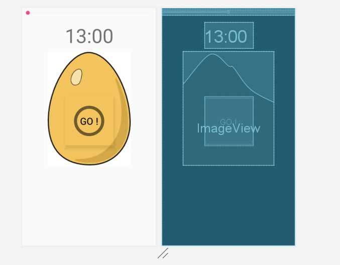

So the exact time for egg boiling is 13 mins. 
And because im lazy to set timer, i created a timer app for processing the works for timing stuff :)  
just name your project "EggTimer" and paste this main folder inside your project proper structure. 

