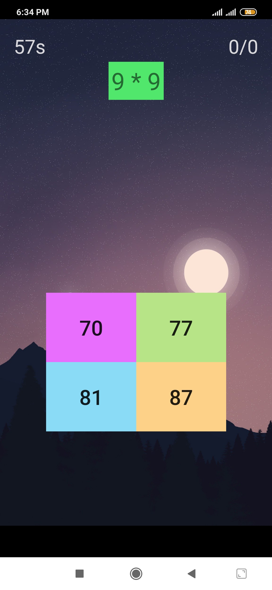

```diff
9 Four Answers Math Game
```
A four answer math game based on "scheme.jpg" picture!</br>
Copy this files inside your project structure and change "package com.ehsanmokhtari.brainchallenger;" with your project package name.</br>
"Quotes.java" file is for showing texts based on lose or win situation and thats all!(also its in persian language)
</br></br>

