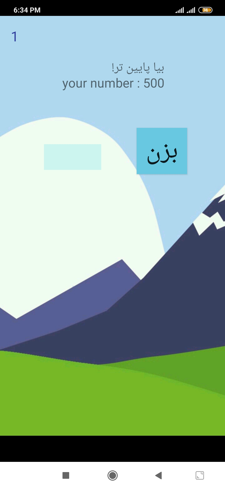

```diff
+ Higher Or Lower Game
```
A guessing number math game based on "scheme.jpg" picture!</br>
Also know that it is on Persian language.</br>
Copy this files inside your project structure and change "package com.ehsanmokhtari.brainchallenger;" with your project package name.</br>
"Quotes.java" file is for showing texts based on lose or win situation and thats all!(also its in persian language).</br>
just guess the random number given based on the hints given in Persian language!
</br></br>

