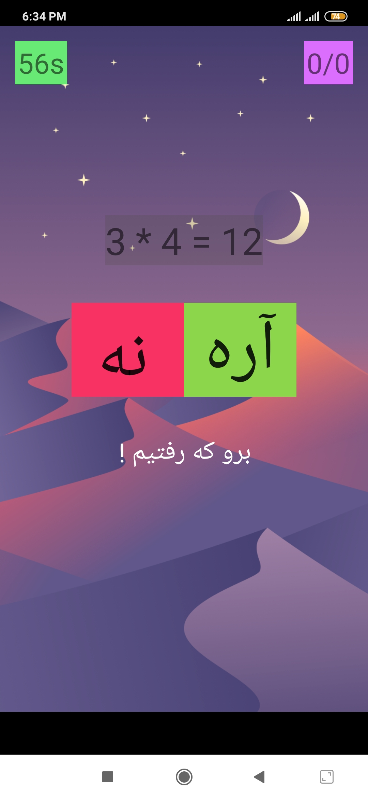

```diff
+ Yes Or No Math Game
```
A yes or no math game based on "scheme.jpg" picture!</br>
Also know that it is on Persian language.</br>
Copy this files inside your project structure and change "package com.ehsanmokhtari.brainchallenger;" with your project package name.</br>
"Quotes.java" file is for showing texts based on lose or win situation and thats all!(also its in persian language).</br>
just smash yes or no button based on the math equation showed on the screen and have some fun!.
</br></br>

